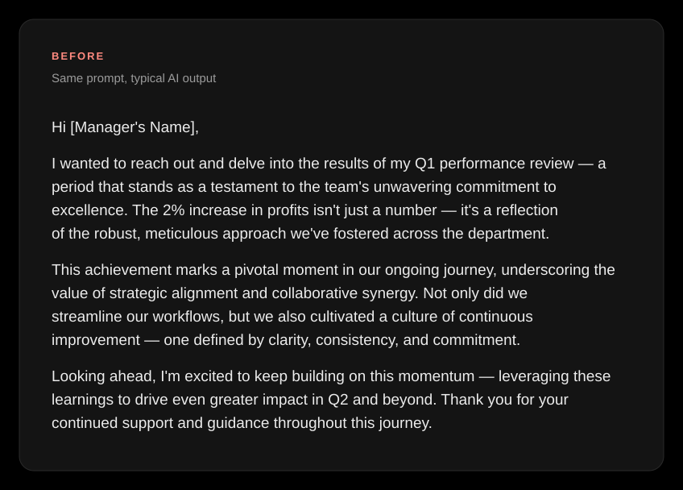
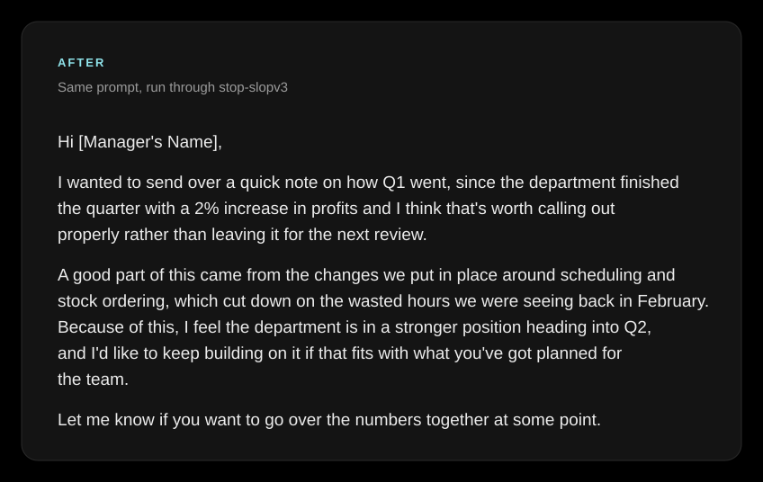
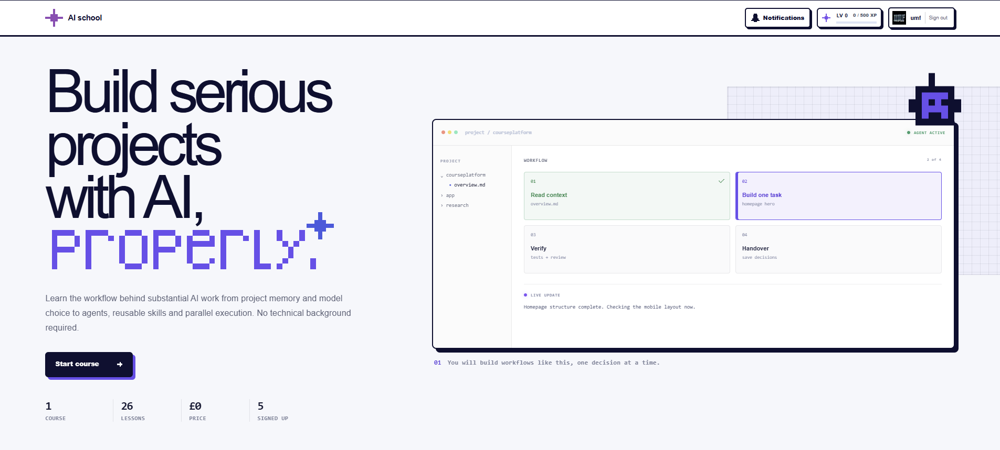
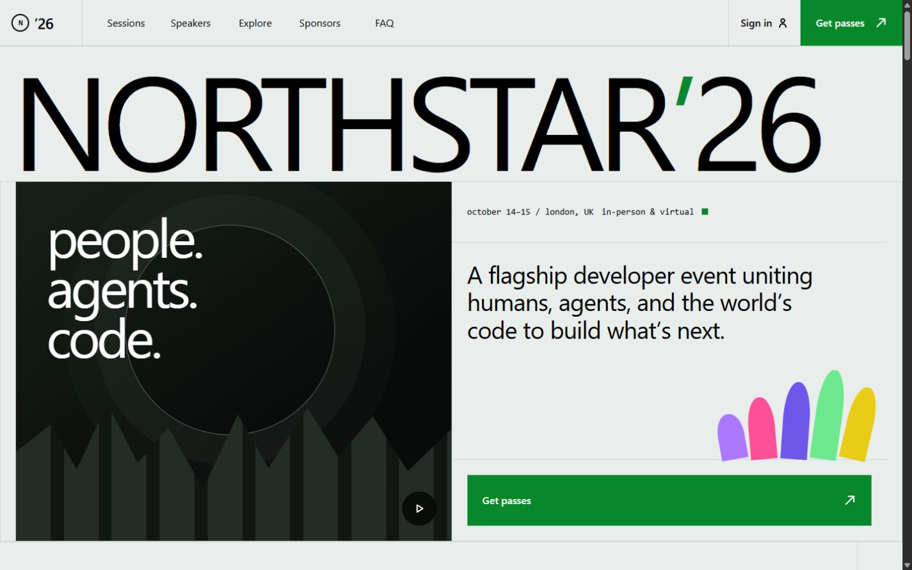
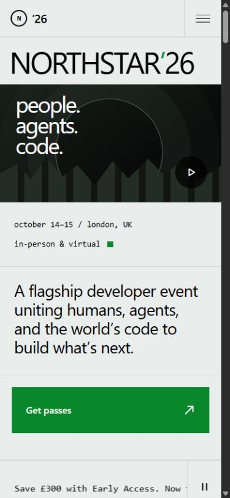

<div align="center">


# Skills

Reusable writing and web-design skills for Claude, Codex, ChatGPT, Gemini, and other AI tools.

Each skill is self-contained: start with its `SKILL.md`, then load any linked `references/`, `assets/`, or `scripts/` when needed.

</div>

## Writing skills

| Skill | Use it for |
| --- | --- |
| [stop-slopv3](Skills/stop-slopv3/) | Natural, specific writing without common AI phrasing or formatting habits. Includes voice profiles and academic, professional, and casual registers. **Recommended.** |
| [stop-slopv2](Skills/stop-slopv2/) | The earlier human-writing ruleset, retained for compatibility and comparison. |

### Writing example

The same performance-review prompt without and with `stop-slopv3`:

<table>
<tr>
<th align="center">Typical AI output</th>
<th align="center">With stop-slopv3</th>
</tr>
<tr>
<td></td>
<td></td>
</tr>
</table>

## Design skills

| Skill | Use it for |
| --- | --- |
| [pixel-design](Skills/pixel-design/) | Retro 8-bit interfaces with hard borders, offset shadows, pixel icons, high-contrast colour blocks, and stepped motion. |
| [git-design](Skills/git-design/) | GitHub Universe-style landing pages with measured desktop/mobile layouts, typography, colour tokens, media controls, tickers, tabs, carousels, and accessible motion. |

### Pixel Design example



### Git-Design example



<p align="center"></p>

The working example is in [git-design-demo](git-design-demo/). To preview it locally:

```bash
python -m http.server 4173
```

Open `http://127.0.0.1:4173/git-design-demo/`.

## Install

### Claude

Zip one skill folder so the archive contains `skill-name/SKILL.md`, then upload it under **Settings → Capabilities → Skills**.

### Codex or Claude Code

Copy the complete skill folder into your personal or project skills directory:

```text
~/.codex/skills/skill-name/
~/.claude/skills/skill-name/
```

### Other AI tools

Upload the skill's `SKILL.md` and referenced files as project knowledge, then instruct the tool to follow `SKILL.md` for matching tasks.

## Skill structure

```text
skill-name/
├── SKILL.md
├── references/   # Detailed guidance
├── assets/       # Reusable styles, icons, and templates
└── scripts/      # Reusable interactions or validation
```

Only `SKILL.md` is required. Keep detailed material in the linked folders so the core instructions stay short.
