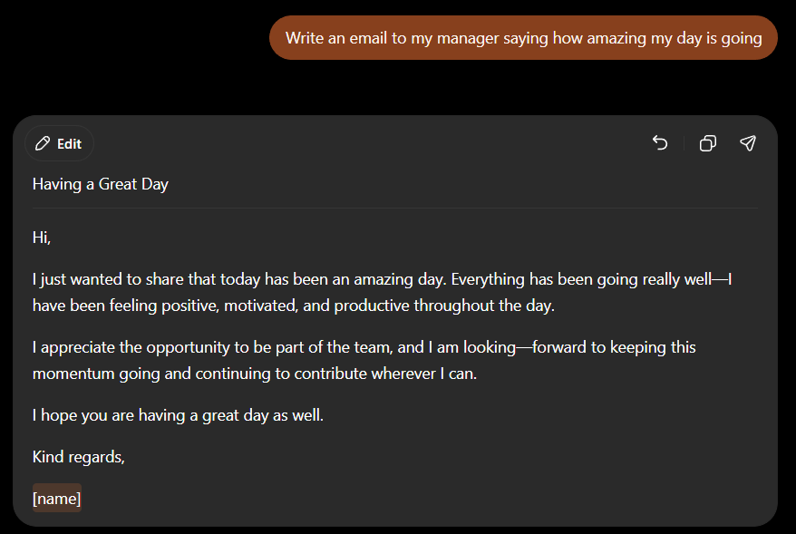
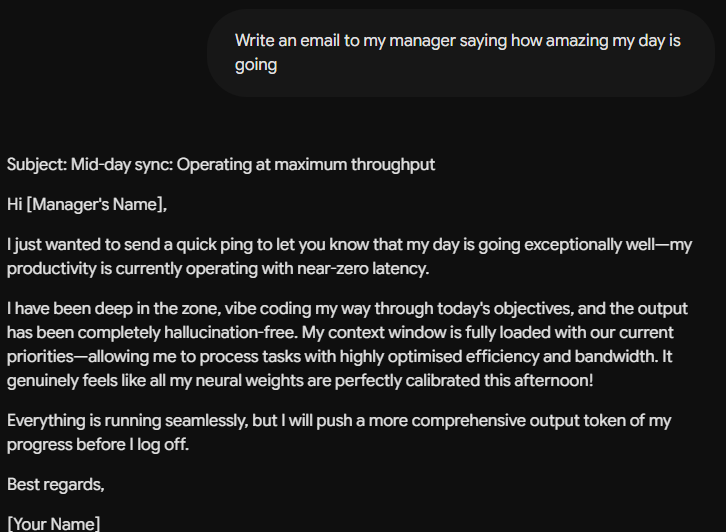
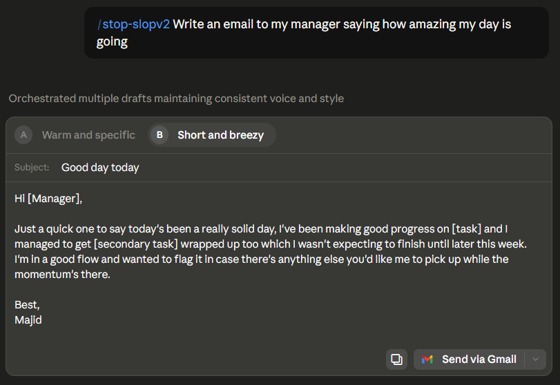

<div align="center">


# Skills

**A public collection of reusable AI skills, written in plain markdown so they work anywhere and can be used from any machine.**

Each skill is a folder containing a `SKILL.md` (the instructions) plus optional `references/` files with extra detail.

</div>

---

## Why use a skill?

A skill is a set of instructions the AI loads automatically, instead of you re-explaining what you want every single chat.

| | Without a skill | With a skill |
| --- | --- | --- |
| **Setup per chat** | Re-type or re-paste your preferences every time | Nothing, it loads automatically |
| **Consistency** | Output changes from chat to chat | Same rules applied every time |
| **Quality** | Generic AI defaults (em-dashes, "delve", buzzwords) | Your rules baked in, checked against ban lists |
| **Time** | Several rounds of "no, rewrite it like..." | Right on the first attempt |
| **Sharing** | Locked in your head | Anyone can download the folder and get the same results |

---

## See the difference

Same prompt given to each model: *"Write an email to my manager saying how amazing my day is going"*.

### Without a skill

GPT and Gemini both produce writing that reads instantly as AI: em/en dashes everywhere, over-polished sentences, and in Gemini's case it doesn't even sound like a human day ("my productivity is currently operating with near-zero latency").

<table>
<tr>
<th align="center">GPT — em-dashes, stiff corporate filler</th>
<th align="center">Gemini — em-dashes, reads like a robot</th>
</tr>
<tr>
<td></td>
<td></td>
</tr>
</table>

### With a skill (Claude + stop-slopv2)

No em-dashes, no buzzwords, natural sentence flow. It reads like something a person would actually send to their manager.

<div align="center">

</div>

---

## Available skills

| Skill | Path | What it does |
| ----- | ---- | ------------ |
| **stop-slopv2** | [Writing/stop-slopv2](Writing/stop-slopv2/) | Makes AI writing sound human. Strips AI tells (em-dashes, "delve", punchy fragments, LinkedIn performativity) and applies a personal writing fingerprint with a register system for academic, professional, and casual writing. |

---

## How to use a skill

### Claude (claude.ai website / app)

1. Download the skill's root folder (e.g. `stop-slopv2/`, the folder that contains `SKILL.md`).
2. Zip that folder so the zip contains the folder itself, e.g. `skill.zip` → `stop-slopv2/SKILL.md`.
3. On claude.ai go to **Settings → Capabilities → Skills** and upload the zip.
4. Claude will now use the skill automatically whenever it is relevant.

### Claude Code (CLI / VS Code)

Copy the skill folder into one of:

- `~/.claude/skills/` to make it available everywhere (personal)
- `.claude/skills/` inside a project to share it with that repo

No zipping needed, Claude Code picks it up on the next session.

### ChatGPT / Gemini / other tools

There is no native skill format, but the same files work as instructions:

- **Custom GPT / Projects / Gems:** upload the `SKILL.md` and any `references/` files as knowledge, then add an instruction like "Follow SKILL.md for all writing tasks".
- **Single chat:** paste the contents of `SKILL.md` at the start of the conversation.

---

## Adding a new skill

1. Create a folder for it (grouped by category, e.g. `Writing/my-skill/`).
2. Add a `SKILL.md` with frontmatter at the top:

   ```markdown
   ---
   name: my-skill
   description: "One or two sentences saying what the skill does and when to use it."
   ---

   # My Skill

   Instructions go here.
   ```

3. Put any longer supporting material in a `references/` subfolder and link to it from `SKILL.md`, so the main file stays short and the detail gets loaded only when needed.
